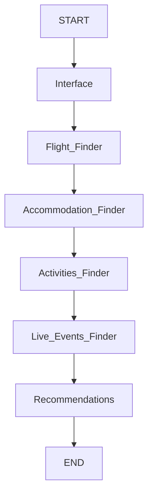

# Travel Itinerary Multi-Agent System

This project implements a multi-agent system to generate personalized travel itineraries. It uses a series of interconnected nodes to gather information about flights, accommodations, activities, live events, and recommendations for a seamless travel planning experience. The system is designed to simplify travel planning by integrating various tools and automating the process.

---

## Features

1. **User Interface**:
   - Interacts with the user to collect input about travel preferences, including destination, dates, budget, and interests.

2. **Flight Finder**:
   - Searches for flight options based on the user’s travel dates and preferences.

3. **Accommodation Finder**:
   - Locates accommodations (hotels, rentals, etc.) tailored to the user's budget and preferences.

4. **Activity Finder**:
   - Identifies popular activities and points of interest at the destination.

5. **Live Events Finder**:
   - Searches for live events (e.g., concerts, sports, festivals) using the Ticketmaster API.

6. **Recommendation Generator**:
   - Provides tailored travel recommendations, including tips on safety, weather, local customs, transportation, and more.

---

## Workflow

The project uses a state graph to define the flow of the travel planning process:

1. **Interface Node**: Collects user preferences.
2. **Flight Node**: Searches for flight options based on user input.
3. **Accommodation Node**: Finds accommodations that align with the user’s budget and location preferences.
4. **Activities Node**: Suggests activities and attractions at the destination.
5. **Live Events Node**: Fetches live events happening at the destination during the travel period.
6. **Recommendation Node**: Combines all the information and generates personalized travel recommendations.

---

## System Architecture

The workflow is represented as a directed graph:



Each node in the graph represents a specific task in the travel planning process, and edges define the sequence of operations.

---

## Setup and Usage

### Prerequisites
- Python 3.9 or later
- Required libraries:
  - `langchain`
  - `langgraph`
  - `mermaid`
  - `graphviz`
  - `ticketmaster` (or any other live event API library)

### Installation
1. Clone this repository:
   ```bash
   git clone https://github.com/yourusername/travel_itinerary.git
   cd travel_itinerary
   ```
2. Install dependencies:
   ```bash
   pip install -r requirements.txt
   ```

### Running the Project
1. Define your configuration in the `Configuration` schema.
2. Build the graph:
   ```python
   graph = builder.compile()
   ```
3. Visualize the workflow:
   ```python
   from IPython.display import Image
   display(Image(graph.get_graph().draw_mermaid_png()))
   ```
4. Run the graph:
   ```python
   output = graph.invoke(input_state)
   ```

---

## Future Improvements
- Integration with additional APIs for broader event and activity coverage.
- Support for multi-destination itineraries.
- Enhanced personalization using machine learning models.

---

## Contributions
Contributions are welcome! Feel free to submit a pull request or open an issue if you have suggestions for improvements.

---

## License
This project is licensed under the MIT License. See the `LICENSE` file for details.

---

## Contact
For questions or support, please contact [Your Name] at [your_email@example.com].

